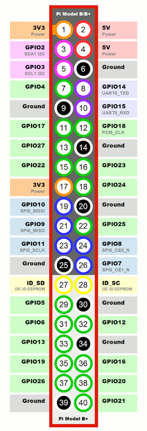

# Raspberry Pi Pet Cam

## Project setup

Clone this project:

    git clone git@bitbucket.org:inthepocket/raspberry-pi-pet-cam.git

Install Node.js (latest LTS)

    http://nodejs.org

Install all dependencies

    npm install

## Run project

Run app as the root user

    sudo node index.js

## Options

    ./config/default.json

## Hardware

- Raspberry Pi 3 Model B
- PIR motion sensor
- Pi camera module
- Female to female jumper wires

### Pi camera module

Don't forget to enable the camera module in the pi config:

### PIR motion sensor:

Before booting your Raspberry Pi, connect the PIR module to the Raspberry Pi.

Using three female-to-female jumper cables, you'll need to connect each of the PIR sensor's connectors to the appropriate pins on the Raspberry Pi. Don't rely on the diagram to identify which pin is which, though: check the labels on the PIR.

1. Connect the one labelled VCC on the PIR sensor to the 5V pin on the Raspberry Pi. This provide power to the PIR sensor.
2. Connect the one labelled GND to a ground pin on the Raspberry Pi. This completes the circuit.
3. Connect the one labelled OUT to GPIO pin 4. This pin will output a voltage when motion is detected, that can then be received by the Raspberry Pi

On the PIR module you should see two orange components with sockets that fit a Phillips screwdriver (see above). These are called potentiometers: they allow you to adjust the sensitivity of the sensor and the detection time. You should begin by setting the sensitivity to max and the time to min, but you can vary this later if you wish.

## Hardware setup

## Raspberry Pi board pin numbers

## Sources

- [https://www.raspberrypi.org/documentation/](https://www.raspberrypi.org/documentation/)
- [https://github.com/rwaldron/johnny-five/wiki/Motion](https://github.com/rwaldron/johnny-five/wiki/Motion)
- [https://github.com/girliemac/RPi-KittyCam](https://github.com/girliemac/RPi-KittyCam)
